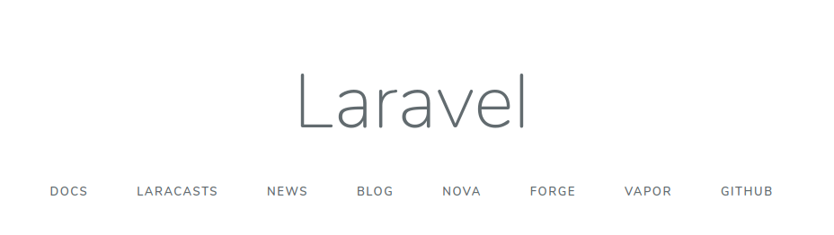

# Laravel from the scratch

This is a guide for working with laravel from scratch, having already installed the diferent dependencies needed to work with laravel.

## Create the project

We well use this command to create a new laravel project with name "lfts.isw811.xyz" with laravel version 6.8.

```cmd
composer create-project --prefer-dist laravel/laravel:6.8 lfts.isw811.xyz
```

Usually you create a project with the command:

```cmd
laravel new project-name
```

But the laravel website insist in using this command at the date.

### Creating the .conf file
This file allows the project to be executed under its server name and other important configurations.

```cmd
<VirtualHost *:80>
    ServerAdmin ahidalgoa1310@gmail.com
    ServerName lfts.isw811.xyz
    ServerAlias www.lfts.isw811.xyz
    
    # Indexes + Directory Root.
    DirectoryIndex index.php
    DocumentRoot /home/vagrant/sites/lfts.isw811.xyz/public
   
    <Directory /home/vagrant/sites/lfts.isw811.xyz/public>
        DirectoryIndex index.php
        AllowOverride All
        Require all granted
    </Directory>
   
    ErrorLog ${APACHE_LOG_DIR}/lfts.isw811.xyz.error.log

    # Possible values include: debug, info, notice, warn, error, crit,
    # alert, emerg.
    LogLevel warn
    CustomLog ${APACHE_LOG_DIR}/lfts.isw811.xyz.access.log combined
</VirtualHost>
```
### Enable the site
 You need to enable the site so apache might be able to serve it and then reload apache to check the changes.

 ```cmd
sudo a2ensite lfts.isw811.xyz 
systemctl reload apache2
```
After this, you should be able to go into your browser and check the site [lfts.isw811.xyz](http://lfts.isw811.xyz) which should be avaliable and showing laravel's default view.

