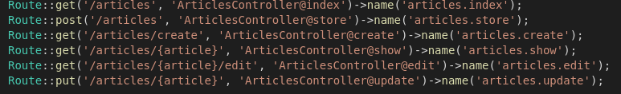

## Controllers Techniques

### Wildcard
A wildcard character is used to substitute one or more characters in a string.
Wildcard characters are used with the SQL LIKE operator. The LIKE operator is used in a WHERE clause to search for a specified pattern in a column.

### Validations
Are useful to avoid the user to have issues or experience any sort of mistake or error from the service/web app/app. In this case most useful is before showing any data, firs check if said data exists.

