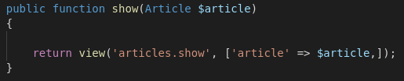
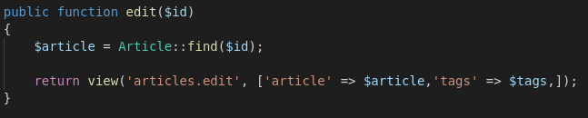
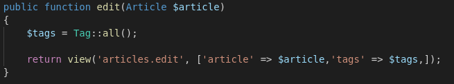
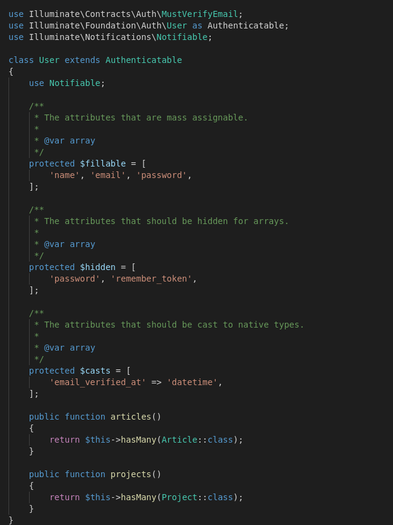
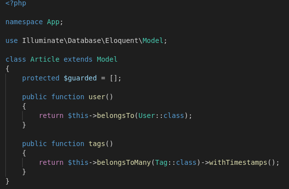
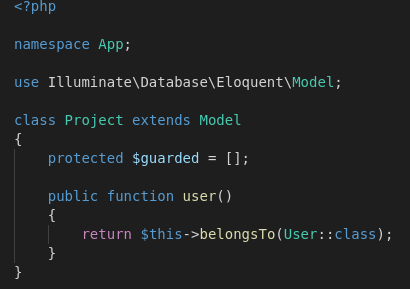

# Controllers Techniques

### Wildcard
A wildcard character is used to substitute one or more characters in a string.
Wildcard characters are used with the SQL LIKE operator. The LIKE operator is used in a WHERE clause to search for a specified pattern in a column.



### Validations
Are useful to avoid the user to have issues or experience any sort of mistake or error from the service/web app/app. In this case most useful is before showing any data, firs check if said data exists.




By editing the wildcards and making usage of them is possible to remove some code and by default making it shorter and easier to manage. For example by editing article in the method edit is possible to jump one step and remove code that otherwise would be redundant.

<br/>
<br/>
<br/>

# Eloquent

### What is it?
The Eloquent ORM included with Laravel provides a beautiful, simple ActiveRecord implementation for working with your database. Each database table has a corresponding "Model" which is used to interact with that table.

### ORM
Object-relational mapping (ORM, O/RM, and O/R mapping tool) in computer science is a programming technique for converting data between incompatible type systems using object-oriented programming languages. This creates, in effect, a "virtual object database" that can be used from within the programming language.

And such its posible to create instances, references and calls easier. This is true as well for relationships, for example 1 to 1, 1 to many, many to many. And by continuing with the course will become easier to work with the eloquent classes and objects.



In user.php is declared that it posses atributes such as name, email and password. But lather is declared that an user can have many projects and many articles.



In articles.php is declared that an article belong to many users and many tags as well.



And for projects finally, it is mentioned that a project belongs to an user.

<br>
<br>
<br>

# Authentication

First we add a package for using the scaffolding of UI with VueJs FE.
`$composer require laravel/ui --dev`
Then we need to scaffold it by:
`$ php artisan ui vue --auth`
then we can check our project or run:
`$ php artisan route:list`
for having a list of the routes for this project

Now we have the Auth scaffold in the project.
The next is creating a DataBase for this project since we are not using a DB.

Now we can just go to the .env file, where we can setup the DabaBase connection variables.
Now we can migrate our Database with:
`$php artisan migrate`
and it will create the tables in the DataBase.

In the routes we can reference the authetication needed for each route as a *middleware* by adding it into the controller or directly in the router.
By adding `->middleware('auth');` in to the route
Then in our app we can access the user data from the just with `$ {{ Auth::user()->name }}`

For calling this params from the AuthAPI we need to verify first is it exist the value by adding a directive:
`$@if (Auth:check())`
or we can use `@if @else @endif`
or we can use `@ifauth @else @endauth`
<br>
<br>
<br>

# Core Concepts

## Object
A Laravel object is just a PHP object, but a PHP object that’s been instantiated via the Application object’s make method. You could also call the make method the make factory, or the make factory method.

## Collections

All multi-result sets returned by Eloquent are instances of the Illuminate\Database\Eloquent\Collection object, including results retrieved via the get method or accessed via a relationship. The Eloquent collection object extends the Laravel base collection, so it naturally inherits dozens of methods used to fluently work with the underlying array of Eloquent models.

All collections also serve as iterators, allowing you to loop over them as if they were simple PHP arrays:

```php
$users = App\Models\User::where('active', 1)->get();

foreach ($users as $user) {
    echo $user->name;
}
```

However, collections are much more powerful than arrays and expose a variety of map / reduce operations that may be chained using an intuitive interface. For example, let's remove all inactive models and gather the first name for each remaining user:

```php
$users = App\Models\User::all();

$names = $users->reject(function ($user) {
    return $user->active === false;
})
->map(function ($user) {
    return $user->name;
});
```

## Query Builder
Laravel's database query builder provides a convenient, fluent interface to creating and running database queries. It can be used to perform most database operations in your application and works on all supported database systems.

The Laravel query builder uses PDO parameter binding to protect your application against SQL injection attacks. There is no need to clean strings being passed as bindings.


## Filter
The filter method filters the collection using the given callback, keeping only those items that pass a given truth test:

```php
$collection = collect([1, 2, 3, 4]);

$filtered = $collection->filter(function ($value, $key) {
    return $value > 2;
});

$filtered->all();

// [3, 4]
```

## Map
The map method iterates through the collection and passes each value to the given callback. The callback is free to modify the item and return it, thus forming a new collection of modified items:
```php
$collection = collect([1, 2, 3, 4, 5]);

$multiplied = $collection->map(function ($item, $key) {
    return $item * 2;
});

$multiplied->all();

// [2, 4, 6, 8, 10]
```
## Pluck
The pluck method retrieves all of the values for a given key:
```php
$collection = collect([
    ['product_id' => 'prod-100', 'name' => 'Desk'],
    ['product_id' => 'prod-200', 'name' => 'Chair'],
]);

$plucked = $collection->pluck('name');

$plucked->all();

// ['Desk', 'Chair']
```
You may also specify how you wish the resulting collection to be keyed:
```php
$plucked = $collection->pluck('name', 'product_id');

$plucked->all();

// ['prod-100' => 'Desk', 'prod-200' => 'Chair']
```
If duplicate keys exist, the last matching element will be inserted into the plucked collection.

## Collapse 
The collapse method collapses a collection of arrays into a single, flat collection:
```php
$collection = collect([[1, 2, 3], [4, 5, 6], [7, 8, 9]]);

$collapsed = $collection->collapse();

$collapsed->all();

// [1, 2, 3, 4, 5, 6, 7, 8, 9]
```

You can check the rest of laravel collection funcions, methods and characterists [here](https://laravel.com/docs/8.x/collections) and [here](https://laravel.com/docs/8.x/eloquent-collections) for eloquent.
