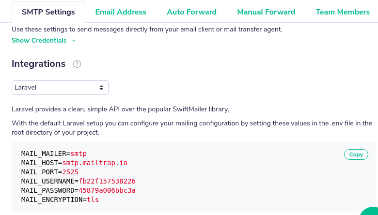
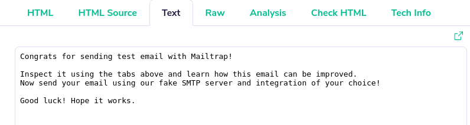
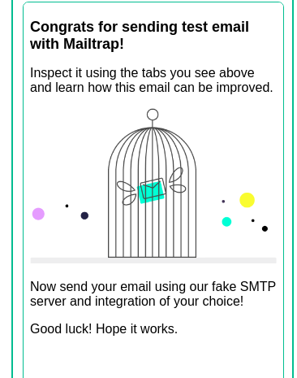

# Send Raw Mail

### Controller

The [controller](./controllers.md) is in charge to validate the email value, here in case the email is correct the view will be redirected to a confirmation being shown. In case otherwise, it's should just show an error message.
```php
namespace App\Http\Controllers;

use App\Mail\Contact;
use Illuminate\Support\Facades\Mail;

class ContactController extends Controller
{
    public function show()
    {
        return view('contact.show');
    }

    public function store()
    {
        request()->validate(['email' => 'required|email']);

        Mail::to(request('email'))
            ->send(new Contact());

        return redirect(route('contact.show'))
            ->with('message', 'Email sent!');
    }
}
```

### Contact Interface and Forms

Forms are used to get input from the user and submit it to the web server for processing. A form is an HTML tag that contains graphical user interface items such as input box, check boxes radio buttons etc. The form is defined using the ``` <form>...</form> ``` tags and GUI items are defined using form elements such as input.

```php
<form>
    @csrf
    <div class="form-group row">
        <label for="email" class="col-md-4 col-form-label text-md-right">E-Mail Address</label>
        <div class="col-md-6">
            <input id="email" type="email" class="form-control @error('email') is-invalid @enderror" name="email" value="{{ old('email') }}" required autocomplete="email" autofocus>
            @error('email')
            <span class="invalid-feedback" role="alert"><strong>{{ $message }}</strong></span>
            @enderror
        </div>
    </div>

    <div class="form-group row mb-0">
        <div class="col-md-6 offset-md-4">
            <button type="submit" class="btn btn-outline-primary">
            Contact Us
            </button>
        </div>
    </div>
</form>
```


### Errors

The error segment comunicates directly with the variable 'email' to check its value and that also might follow the stablished rules and validations to it.

```php
@error('email')
    <span class="invalid-feedback" role="alert"><strong>{{ $message }}</strong></span>
@enderror
```

### Add to route

Finally add to web.php in routes to access inside contact.

```php
Route::get('/contact', function () {
    return view('contact');
});

Route::get('/contact', 'ContactController@show')->name('contact.show');
Route::post('/contact', 'ContactController@store')->name('contact.store');
```

# Simulate an Inbox using Mailtrap

### Mailtrap 
Mailtrap is a test mail server solution that allows testing email notifications without sending them to the real users of your application. Not only does Mailtrap work as a powerful email test tool, it also lets you view your dummy emails online, forward them to your regular mailbox, share with the team and more! Mailtrap is a mail server test tool built by Railsware Products, Inc., a premium software development consulting company.


### Configuration
Go to your .env file and change the mail server data to: 
```
MAIL_MAILER=smtp
MAIL_HOST=smtp.mailtrap.io
MAIL_PORT=2525
MAIL_USERNAME=fb22f157538226
MAIL_PASSWORD=45879a006bbc3a
MAIL_ENCRYPTION=tls
```
FYI: set your corresponding credentials here

Just go to your SMPT settings and choose laravel as the desired integration, or either the one you need, then you'll get the required configutation.




# Send an email
After correctly configuring smtp you can enter contacts view and send an email, after that check your inbox in mailtrap, you should get something like this:



<br>
<br>
<br>

And for HTML:

