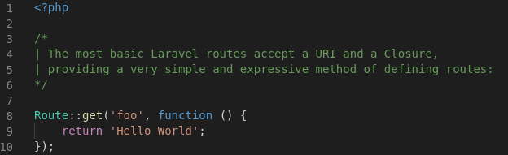
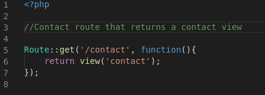
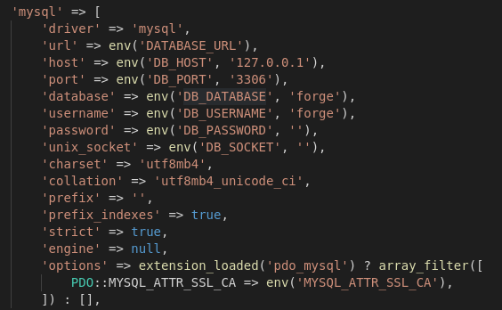
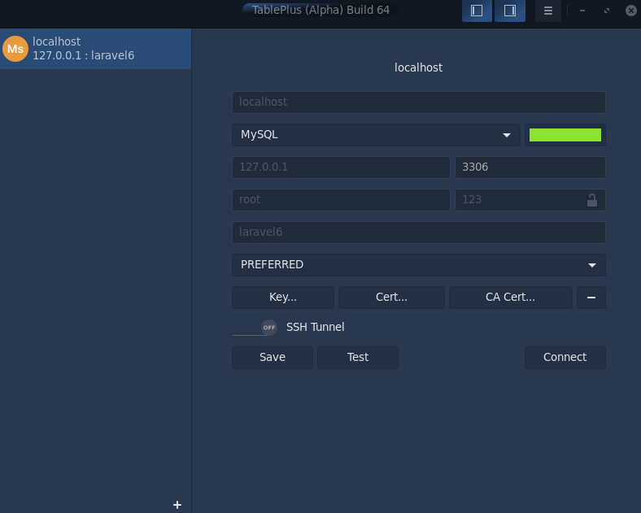
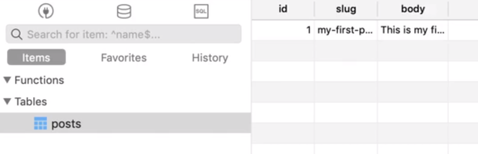
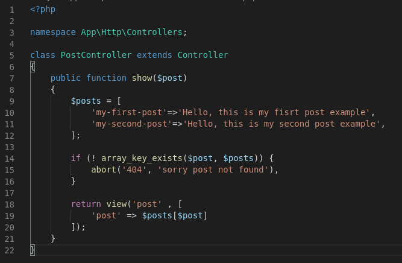

# Routing

In the context of a server-side web application, a routing system is the part of the web application that maps an HTTP request to a request handler (function/method). 

An HTTP request consists of a header and optionally a body. The header contains information about the request for example the method, path and host. Some methods like GET, HEAD, and OPTIONS do not make use of the request body while others like POST, PUT, and PATCH use it to pass data from a client to a server.

Using a routing system allows us to structure our application in a better way instead of designating each request to a file.

A routing system works by mapping an HTTP request to a request handler based on the request method and path specified in the URL of the request. This is exactly what we are going to build in this tutorial.

In this case, a new route named: new_route.php is created with as a small example:


This is a simple example of a router that returns a Hello World.


And in this case this is a router named contac.php that returns a view named contact.



# Setup a database connection

First step is to directly go to the .env file, this is where enviroment variables are saved and set. If you directly go to config/database.php you can check all the most and needed variables from each database you might want to use. In this case if you go directly to check mysql requirements:

Its not necesary to add every one of them, but some are needed for the databae access.

Now its time to go to the .env file and set our enviroment variables.

```cmd
DB_CONNECTION=mysql  //database
DB_HOST=127.0.0.1    // host in which the database is located
DB_PORT=3306         // port in which the database is running
DB_DATABASE=laravel6 // database name
DB_USERNAME=root     // database username default is root
DB_PASSWORD=         // database user password by default is blank
```

##### To create the database:

Sign in with:
```cmd
mysql -u root
```
Once logged, then create the database.
```cmd
create database laravel6;
```
And then you can use a tool like Table Plus to manage a connection with the database.



Then create a new table named posts and some messages to show later in our controller.


Then we go to PostController from app/http/Controllers, and create a controller for posts.

This controller will allow the usage and consumption directly from the database to create posts.


## Views 

Steps for structuring views in a layout design pattern:

1. We need to make a structure from the views that we have in the project. For this we can create a layout file.
2. Then we got the unique HTML tags and structure in our layout file, since that code is the reusable layout through the site.
3. Afterwards we can do `@extends ('layout')` for extending or inherite the layout structure to the rest of views.
4.`@yield ('content)` we can use for replacing it with a section of content from a view that were created byb `@section('content') <h1>Hola Mundoo</h1> @endsection.` By this way we are dynamically replacing data in the layout structure.
##

## Forms

We have a list of actions:

1. create - Shows a view to create a new resource
2. store - Persist the new resource
3. edit - Show a view to edit a existing resource
4. update - Persist the edited resource
5. destroy - Destroy method for resource
6. show - Show a single resource
7. list - Show multiple resources


`$php artisan make:controller ProjectsController -r -m Project`
This creates the scaffold for the 7 Actions
`-m` is for base in a model, so now we are also creating a data model for this kind of resource.

For Routing a Controller and this 7 actions, we can use the Routing request channel for getting the specific action.
##